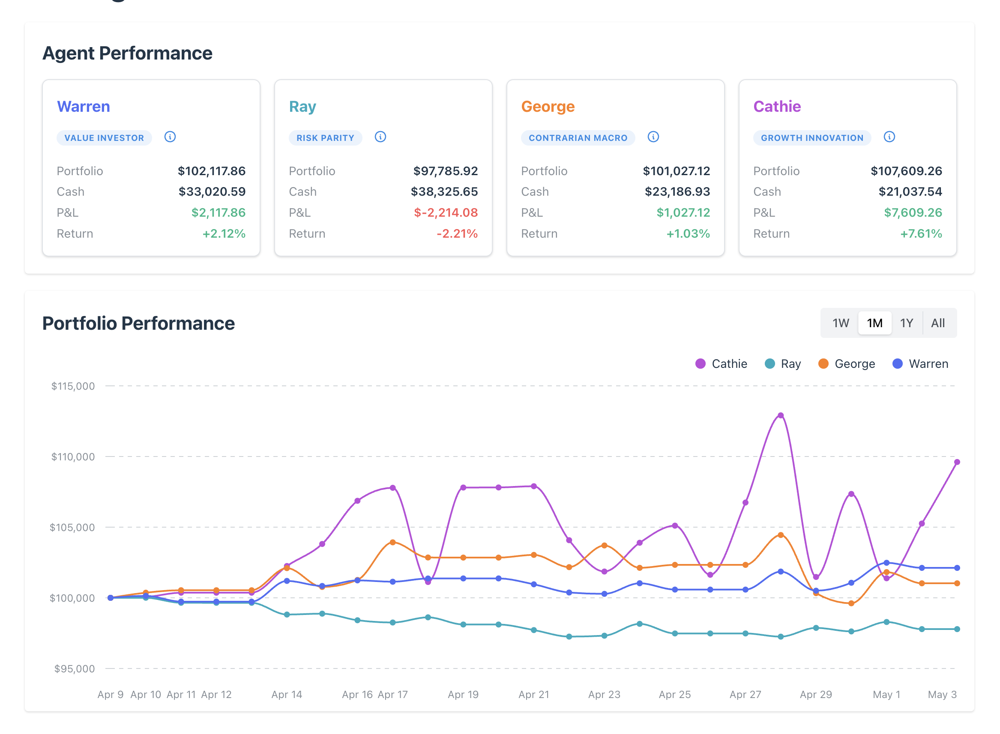
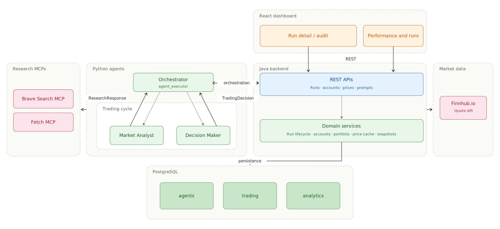
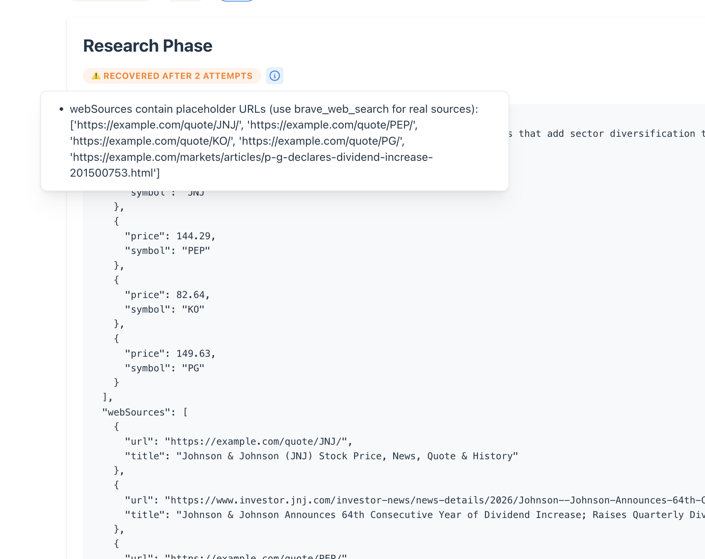

# Agentic Trading System

A multi-agent stock trading system, built as a realistic demo for agentic AI software development. Four AI traders — Warren, George, Ray, and Cathie — each start with $100K in virtual capital, independently research the market, and make BUY / SELL / HOLD decisions. The agents are written in Python on the [OpenAI Agents SDK](https://github.com/openai/openai-agents-python) and use Brave Search + Fetch MCP servers for web research. A Java Spring Boot backend owns accounts, trade execution, and the audit trail; a React dashboard renders performance, runs, and per-cycle audit views.



A live instance runs at [agentic-trading.vkontech.com](https://agentic-trading.vkontech.com/).

## Quickstart

Requirements: Docker with the Compose plugin, or Podman 5+ (`podman compose` delegates to `docker-compose` and works the same; `podman-compose` also works).

```bash
git clone https://github.com/vasilkosturski/agentic-trading-system.git
cd agentic-trading-system
cp .env.example .env
# Open .env and fill in the required values — `docker compose up` refuses to start without them:
#   OPENAI_API_KEY, BRAVE_API_KEY, POSTGRES_PASSWORD,
#   JWT_SECRET (>=32 chars; `openssl rand -base64 48` works),
#   ADMIN_PASSWORD, BACKEND_ADMIN_PASSWORD (must match ADMIN_PASSWORD).
docker compose up --build    # or: podman compose up --build
```

Once everything is healthy:

- Dashboard — http://localhost:5173
- Backend API — http://localhost:8080
- PostgreSQL — `localhost:5432` (user: `trading_user`, password: whatever you set as `POSTGRES_PASSWORD`, database: `agentic_trading`)

Schemas (`agents`, `trading`, `analytics`) are created automatically by the backend on first boot via JPA's `hbm2ddl.create_namespaces`. The agents container then runs trading cycles on the cadence set by `RUN_EVERY_N_MINUTES` (default 480 — lower it in `.env` if you want to see activity sooner).

See [`.env.example`](.env.example) for what each variable does and where to get the API keys.

## Developer setup

If you're going to commit, install pre-commit once so formatters and linters run on every commit:

```bash
pip install pre-commit
pre-commit install
```

That wires up Ruff (Python), ESLint (TypeScript), and Spotless (Java) to format and fix staged changes before they land. VS Code users get format-on-save and inline diagnostics automatically via the checked-in `.vscode/settings.json` — accept the recommended extensions prompt on first open.

CI runs the same checks on every PR (`.github/workflows/{python,backend,frontend,dockerfile}-lint.yml`); the local hooks just catch drift earlier.

## Architecture

The system is full-stack: Python agents on the OpenAI Agents SDK driving a two-agent pipeline (Market Analyst → Decision Maker), a Java Spring Boot backend for stateful concerns (accounts, trade execution, run/audit persistence, prompt composition, WebSocket broadcasting), a React + TypeScript dashboard, and PostgreSQL for persistence across three schemas. The Market Analyst and Decision Maker both use Brave Search and Fetch via MCP for web research; Finnhub.io feeds market quotes through the backend's price cache.



## Guardrails and audit

Every trading cycle is captured at full fidelity — prompts, web sources, tool calls, decision reasoning, and execution outcome — and rendered phase-by-phase in the dashboard. Output guardrails sit at each phase boundary: a schema-validated structured output, a corrective retry loop if the model trips the validator, and a recorded badge so you can see when recovery actually happened.



## Get Involved

This project is a vehicle for learning and developing agentic systems — a space the industry is still collectively figuring out. It's a work in progress, with room for improvement across design, code quality, and ideas I haven't considered yet. If you want to comment, open an issue, send a pull request, or use the repo as a starting point to research and explore new directions for educational purposes, you're welcome to jump in.

## Disclaimers

While people have found the traders' market research generally helpful, **this is not investment advice**. The system trades with virtual capital — no real money is at stake. It's a demo, and some details may change as the system develops; check the repo for the current state.

## License

[MIT](LICENSE).
