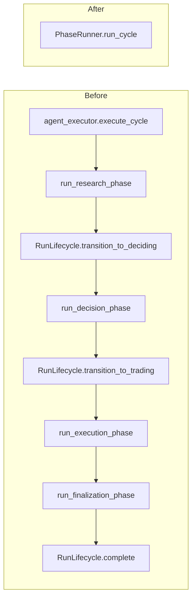

# Codebase Architecture — Deepening Candidates (2026-06-20)

**Project root:** `/Users/vkosturski/Projects/tmp/ai-course-mcp/agentic-trading-system`
**Working tree (submodule):** clean
**Working tree (outer repo view):** `M agentic-trading-system` (submodule pointer ahead — already-committed work in submodule not yet captured by outer)
**Branch:** `main`

## Ranked candidates

| # | Strength | Title | Files | Why it earns its keep |
|---|---|---|---|---|
| 1 | Strong | Collapse the agent phase-runner chain into one `PhaseRunner` Module | 6 | Reading one cycle today means walking `execute_cycle → run_research_phase → lifecycle.transition_to_deciding → run_decision_phase → … → lifecycle.complete` across 6 files. Phase boundary logic is smeared across two files per phase; even the import order is contorted to dodge a circular import. One Interface (`run_cycle(ctx, mcp_pool) → CycleResult`) hides a descriptor-driven loop. |
| 2 | Strong | Merge `TradeOrchestrator` + `TradeExecutor` + `BuyTradeExecutor` + `SellTradeExecutor` into one `TradeService` Module | 4 | Classic shallow-inheritance chain. `TradeOrchestrator.buyShares/sellShares` are 5-line wrappers; the abstract base's `fetchMarketPrice` is dead (both leaves take `price` as a param). Polymorphism doesn't pay off — the two methods are never called through a base reference. |
| 3 | Strong | Inline four pure-function micro-Modules back into their callers | 4 | `ReasoningSummaryExtractor`, `RunStateMachine`, `RunSpecificationFactory`, `AgentIdentityService` are each ~14–34 LOC, each with a single caller, each extracted "for testability" but the real bugs hide in *how* they're called. `AgentIdentityService.requireAgentIdByName` is dead. Deletion concentrates nothing. |
| 4 | Worth exploring | Collapse `ResearchSection`/`DecisionSection`/`ExecutionSection` chrome into one `<PhaseCard>` Module | 7 | Three React sections share identical empty state, header, GuardrailBadge, latency display, and the same call order to `PhaseMetrics`/`PromptsAccordion`/`ToolCallsTable`. Only the phase-body content varies. |
| 5 | Worth exploring | Delete `agents/backend/run_tracking.py` + non-decorated `tools/trading_tools.py` helpers | 3 | Every function is a 2-line forwarder to `BackendClient`. Interface and Implementation are isomorphic — pure delegation. `BackendClient` is already the real Module. |
| 6 | Worth exploring | Merge `agents/utils/sdk_parser.py` into `infra/telemetry.py` as one `Telemetry` Module | 3 | Two Modules whose only collaboration is "parse SDK items → wrap into DTOs." The Seam between them carries one type used in exactly one place. |
| 7 | Speculative | Drop `BackendClient._dispatch_with_auth` and let httpx drive auth | 2 | A 50-line manual auth flow exists in production code purely because a `_FakeHttpxClient` test double doesn't traverse httpx's own auth machinery. Classic "test Seam leaked into production." Push the test Seam down to `httpx.MockTransport`. |

---

## Candidate 1 — Collapse the agent phase-runner chain into one `PhaseRunner` Module

**Strength:** Strong

**Files (6):**
- `agents/agent_executor.py` (244 LOC)
- `agents/phases/research_phase.py` (132)
- `agents/phases/decision_phase.py` (137)
- `agents/phases/execution_phase.py` (94)
- `agents/phases/finalization.py` (143)
- `agents/backend/run_lifecycle.py` (206)

**Problem.** To trace a single trading cycle the reader walks
`execute_cycle → run_research_phase → lifecycle.transition_to_deciding → run_decision_phase → lifecycle.transition_to_trading → run_execution_phase → run_finalization_phase → lifecycle.complete`.
Each phase module is a thin wall around one `Runner.run` plus boilerplate: start a timer, build a context dataclass, capture prompts via the same isinstance-narrow (`research_phase.py:60-66`, `decision_phase.py:91-98`), call `extract_run_telemetry`, return a `*Result`. `agent_executor.py:46-49` even imports the phase modules *after* its constants block to dodge a circular import — a structural smell. The "phase boundary" responsibility is smeared across two files per phase (the phase module and `RunLifecycle`).

**Proposed deepening.** Collapse the four phase modules + `RunLifecycle` into one **`PhaseRunner`** Module with internal phase descriptors. The descriptor table (research / decision / execution / finalize) encodes pre-transition phase, agent factory, prompt-capture rule, telemetry-extraction toggle, and post-transition action. `execute_cycle` becomes a short loop over descriptors. The Interface is a small `run_cycle(ctx, mcp_pool) → CycleResult`. The repeated prompt capture, telemetry extraction, `record_phase_failure` plumbing, and transition+broadcast pairs all live behind that one Interface.

**Deletion test.** Delete `phases/research_phase.py` today — the body collapses into ~30 lines of cycle code; logic concentrates. Good. Deleting `RunLifecycle` alone would just push status broadcasts inline into each phase — bad standalone, but inside the new `PhaseRunner` they vanish.

**Before/after**

**Wins:**
- One place to read the cycle
- Kills circular-import dance
- New phase = new descriptor row
- Removes 3 cloned `try/except OutputGuardrailTripwireTriggered` blocks

---

## Candidate 2 — Merge `Trade*Executor` family into one `TradeService` Module

**Strength:** Strong

**Files (4):**
- `backend/src/main/java/com/trading/service/TradeOrchestrator.java` (71)
- `backend/src/main/java/com/trading/service/TradeExecutor.java` (74, abstract base)
- `backend/src/main/java/com/trading/service/BuyTradeExecutor.java` (157)
- `backend/src/main/java/com/trading/service/SellTradeExecutor.java` (104)

**Problem.** Shallow-inheritance chain. `TradeExecutor.java:17` is an abstract base with three protected helpers (`getAccount`, `fetchMarketPrice`, `createTransaction`) that two leaves share. `TradeOrchestrator.buyShares` (`TradeOrchestrator.java:48-55`) and `sellShares` (`:63-70`) are 5-line wrappers each: fetch price → call leaf → snapshot. `fetchMarketPrice` (`TradeExecutor.java:44-55`) is **dead** — both leaves take `price` as a parameter and never call it (Buy at `:53`, Sell at `:50`). The polymorphism doesn't earn its keep: `buyShares` and `sellShares` are called from different controller paths anyway, never through a single base reference.

**Proposed deepening.** Merge into one **`TradeService`** Module with two methods (`buyShares`, `sellShares`). The shared helpers become private; the `BUY`/`SELL` branch becomes an `enum`-driven switch inside one transactional method. The Interface stays a 2-method surface; the Implementation grows the position-limit / sufficient-funds / sufficient-shares validators, holding-update math, snapshot trigger, and price-fetch — all behind it.

**Deletion test.** Delete `TradeExecutor.java` and `TradeOrchestrator.java` today — half the lines (`fetchMarketPrice`, three near-identical constructors, the `executeBuy`/`buyShares` redundancy) evaporate. Concentrates. Good.

**Wins:**
- 4 files → 1
- Kills dead `fetchMarketPrice`
- Removes 3 redundant constructor bodies
- Validation lives next to the writes it guards

---

## Candidate 3 — Inline four pure-function micro-Modules back into their callers

**Strength:** Strong

**Files (4):**
- `backend/src/main/java/com/trading/service/ReasoningSummaryExtractor.java` (30) — one caller, `MemoryService:224`
- `backend/src/main/java/com/trading/service/RunStateMachine.java` (14) — static one-liner around `RunPhase.canTransitionTo`
- `backend/src/main/java/com/trading/service/RunSpecificationFactory.java` (26) — one caller, `TradingRunService:302`
- `backend/src/main/java/com/trading/service/AgentIdentityService.java` (34) — `requireAgentIdByName` has zero callers (dead)

**Problem.** Each was extracted "for testability" but the bug surface is in how they're *called*, not what they do. `RunStateMachine.requireValidTransition` (`:9`) is a 3-line null-safe wrapper around `RunPhase.canTransitionTo` and could be a default method on the enum. `RunSpecificationFactory.build` (`:13-24`) is a single chained-`and` that runs in exactly one place. `ReasoningSummaryExtractor.extractSummary` (`:20-29`) is null-safety around one field — the only caller is one line in `MemoryService`. `AgentIdentityService.requireAgentIdByName` (`:27`) is dead code.

**Proposed deepening.** Inline each back into its sole caller (or onto the `RunPhase` enum). The Interface that mattered (`TradingRunService.updatePhase`, `MemoryService.assembleSummary`, `TradingRunService.listRuns`) absorbs the extraction with no Depth lost. `AgentIdentityService` shrinks to its two used methods and lives next to its single caller.

**Deletion test.** Delete `RunStateMachine.java` — caller gains 1 line. Pure pass-through, confirmed.

**Wins:**
- 4 files → 0
- Removes one dead method
- Audit-trail readers stop chasing helpers
- Fewer mocks needed in tests

---

## Candidate 4 — Collapse Phase sections into one `<PhaseCard>` Module

**Strength:** Worth exploring

**Files (7):**
- `frontend/src/features/runs/ResearchSection.tsx` (81)
- `frontend/src/features/runs/DecisionSection.tsx` (93)
- `frontend/src/features/runs/ExecutionSection.tsx` (50)
- `frontend/src/features/runs/PhaseMetrics.tsx`
- `frontend/src/features/runs/GuardrailBadge.tsx`
- `frontend/src/features/runs/PromptsAccordion.tsx`
- `frontend/src/features/runs/ToolCallsTable.tsx`

**Problem.** `ResearchSection.tsx:11-19` and `DecisionSection.tsx:11-19` share an identical "Paper / Title / 'Phase not completed'" empty state. Their headers (`:22-36` in both) share the same Paper / Title / GuardrailBadge / latency-display layout. Both then call `PhaseMetrics`, `PromptsAccordion`, `ToolCallsTable` in the same order. The phase-body (candidates+notes+sources vs decision+reasoning+contexts vs execution outcome) is the only real variance — yet the chrome around it is duplicated three ways.

**Proposed deepening.** Introduce one **`<PhaseCard phase={...}>`** Module whose Interface accepts a phase object plus a render-children slot for the body-specific bits. The empty state, header, guardrail badge, latency, metrics, prompts, and tool-calls table all live behind the Card.

**Deletion test.** Delete `DecisionSection.tsx` — its body content (decision badge + 3 reasoning blocks) is the only non-duplicated lift; `PhaseCard` absorbs all chrome. Concentrates. Good.

**Wins:**
- Single source of truth for empty state
- New phase = ~20 LOC, not 80
- Header layout drift impossible

---

## Candidate 5 — Delete `agents/backend/run_tracking.py` + thin `trading_tools.py` helpers

**Strength:** Worth exploring

**Files (3):**
- `agents/backend/run_tracking.py` (86)
- `agents/tools/trading_tools.py` (55)
- `agents/backend/client.py` (405, the real Module)

**Problem.** Every function in `run_tracking.py` is a 2-line forwarder: `client = get_backend_client(); return await client.X(...)` — `create_run` (`:33-34`), `update_phase` (`:50-51`), `complete_run` (`:66-67`), `record_phase_failure` (`:85-86`). `tools/trading_tools.py:18-19, 32-33, 39-40, 44-45, 49-50, 54-55` follows the same pattern: get client, call same-named method, log. Interface and Implementation are isomorphic — pure delegation. The "tool" framing only matters for `function_tool`-decorated entries, of which `trading_tools.py` currently has zero.

**Proposed deepening.** Callers (`RunLifecycle`, `agent_executor`) talk to `BackendClient` directly via `get_backend_client()`. Delete `backend/run_tracking.py` and the non-decorated helpers in `tools/trading_tools.py`. The `BackendClient` Interface absorbs everything that mattered.

**Deletion test.** Delete `run_tracking.py` — `RunLifecycle` imports change to the client object it already needs. No new code; net negative. Good.

**Wins:**
- 2 files → 0
- One way to call the backend
- Less mock surface in tests

---

## Candidate 6 — Merge `sdk_parser.py` into `infra/telemetry.py` as one `Telemetry` Module

**Strength:** Worth exploring

**Files (3):**
- `agents/utils/sdk_parser.py` (146)
- `agents/infra/telemetry.py` (120)
- `agents/infra/pricing.py` (56, stays as a data table)

**Problem.** `extract_run_telemetry` (`telemetry.py:92-120`) calls `sdk_parser.extract_tool_calls(result.new_items)` and then immediately wraps each into a `ToolCallDto`. Two separate Modules whose only collaboration is "parse SDK items → wrap into DTOs → pair with usage." The Seam between them carries one type (`ParsedToolCall`) used in exactly one place. `market_analyst.py:275` and `decision_maker.py:228` both also call `extract_tool_calls` directly, but only to feed `get_tool_errors` — never standalone.

**Proposed deepening.** Merge into one **`Telemetry`** Module: `extract_run_telemetry(result, model_name, agent_label) → (list[ToolCallDto], UsageMetrics)` plus a separate `extract_tool_errors(result)` for the warning path. `ParsedToolCall` becomes private. Pricing stays a data table (it earns its keep).

**Deletion test.** Delete `sdk_parser.py` — its callers concentrate around telemetry assembly. Good unless additional non-telemetry callers exist (worth grep-verifying during grilling).

**Wins:**
- One SDK-translation surface
- Hides `ParsedToolCall` as private detail
- Easier mock for tests

---

## Candidate 7 — Push the `BackendClient` test Seam down to `httpx.MockTransport`

**Strength:** Speculative

**Files (2):**
- `agents/backend/client.py` (405)
- `agents/backend/auth.py` (93)

**Problem.** `BackendClient._dispatch_with_auth` (`client.py:116-168`) hand-drives the `JwtAuth.auth_flow` generator instead of letting httpx do it via the standard `auth=` parameter. The comment at `:131-135` explains: *"exists because `_FakeHttpxClient` test doubles don't go through httpx's own auth machinery."* So a test-only fake forced a 50-line manual auth flow in production code. The `is_login` branch (`:143-156`) re-serializes the login body that httpx already serialized — a request the auth flow yielded gets parsed back out and re-issued. Classic "test Seam leaked into production code." One Adapter today; the right move is to ditch the manual flow.

**Proposed deepening.** Push the test-double Seam down to the `httpx.AsyncClient` level (use `httpx.MockTransport`, which *does* go through auth machinery) and use `client.request(..., auth=self._get_auth())` for the production path. The `BackendClient` Interface stays identical; the Implementation drops `_dispatch_with_auth` and `_json_body_from_request` entirely.

**Deletion test.** Delete `_dispatch_with_auth` — the per-request line becomes `await client.request(method, url, params=params, json=json_data, auth=self._get_auth())`. Concentrates. Good.

**Wins:**
- ~70 lines deleted
- Production path matches the framework
- Test doubles use the framework Seam

---

## Notes for the grilling step

The scout flagged `HoldingsValuationService` (Java) as an **anti-target** — already deep, ~37 lines hiding live-vs-cost-basis fallback behind a one-method Interface. Don't deepen. Same call: Spring controllers, DTO records, `RunDtoMapper` (real entity↔DTO Seam).

**Top three to grill first:** #1 (biggest readability + structural win), #2 (clearest deletion test), #3 (smallest surface, highest signal-to-noise).
